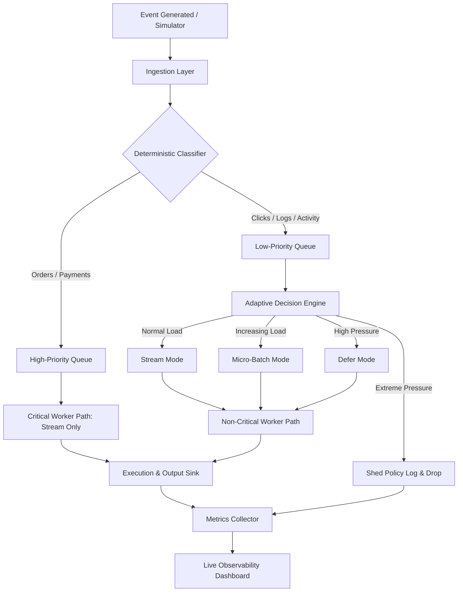
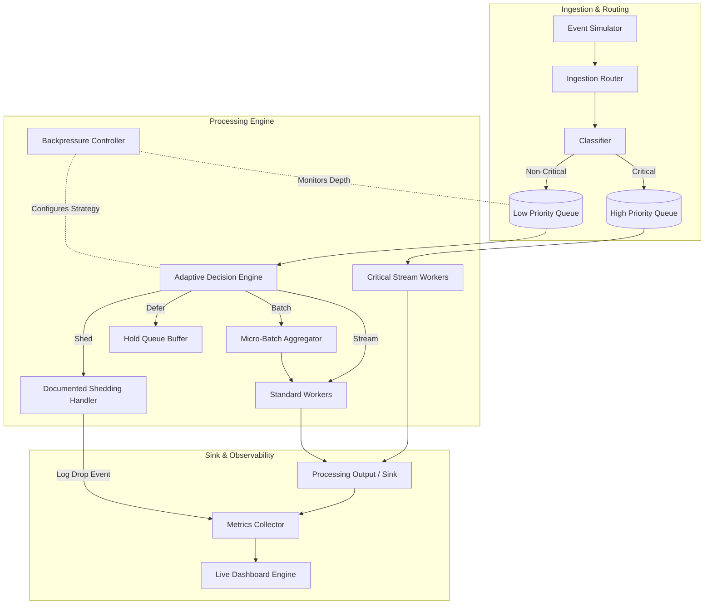

# Adaptive Event-Processing Pipeline

> An adaptive event-processing pipeline that protects critical workloads during sudden traffic spikes in e-commerce applications.

---

## 1. Project Title

**AdaptiFlow**  
*An adaptive event-processing pipeline that protects critical workloads during sudden traffic spikes.*

---

## 2. Problem Statement

In an e-commerce platform, background systems process a constant stream of telemetry and transactional data. Under normal conditions, the system receives approximately **1,000 events per minute**.

However, during a flash sale or promotional event, incoming traffic can spike suddenly by **20×**, reaching **~20,000 events per minute**.

```
Normal Traffic (~1,000 events/min)   ──► [ Naive Pipeline ] ──► System Stable
Flash Sale Spike (~20,000 events/min) ──► [ Naive Pipeline ] ──► Queue Buildup / Latency Spikes / Outages
```

A **naive pipeline** treats every incoming event with equal priority:
* Application logs, clickstream events, inventory updates, orders, and payment transactions are processed identically in arrival order.
* Under a 20× load spike, queues grow uncontrollably, latency degrades across all event types, and critical payment or order transactions get delayed or dropped.

Treating all events equally is inefficient because user clicks and application logs do not carry the same business value or latency sensitivity as customer orders and payments.

---

## 3. Our Solution

**AdaptiFlow** is an adaptive, priority-aware event-processing pipeline that intelligently adjusts its execution strategies based on real-time system conditions.

Instead of expanding infrastructure indefinitely or dropping data indiscriminately, AdaptiFlow isolates critical business events and dynamically shifts the processing behavior of non-critical workloads:

* **Event Ingestion & Simulator:** Generates and ingests a mixed stream of events with controllable load rates and an on-demand 20× spike trigger.
* **Deterministic Classification:** Categorizes events into **Critical** (Orders, Payments) and **Non-Critical** (Clicks, Logs, Inventory activity) tiers.
* **Priority Routing:** Routes critical events directly to an isolated, dedicated high-priority processing queue.
* **Adaptive Strategy Switching:** Dynamically switches non-critical processing between four distinct modes:
  * **STREAM:** Processes events individually and immediately during normal load.
  * **BATCH:** Micro-batches non-critical events into groups under moderate pressure.
  * **DEFER:** Pauses low-priority queue execution to preserve CPU cycles when load increases further.
  * **SHED:** Drops non-critical events according to a strict, logged policy under extreme load pressure.
* **Backpressure Control:** Monitors non-critical queue depth continuously to trigger mode switches and prevent process crashes.
* **Live Observability Dashboard:** Exposes real-time queue depths, latency tiers, processing modes, and drop metrics.

---

## 4. Core Insight

> **"Don't process every event equally — process what matters first."**

Modern backend architectures should degrade non-critical telemetry gracefully during severe oversubscription to ensure that business-critical transactions maintain low latency and zero data loss.

---

## 5. How It Works

The lifecycle of an event passing through AdaptiFlow:



---

## 6. Architecture



### Component Breakdown
1. **Event Simulator:** Generates synthetic e-commerce events (Orders, Payments, Clicks, Logs, Inventory) with adjustable rates (1,000 to 20,000 events/min).
2. **Event Classifier:** Inspects event metadata to assign priority tiers deterministically without ML overhead.
3. **Priority Router:** Separates events into independent high-priority and low-priority memory channels.
4. **Adaptive Decision Engine:** Samples low-priority queue depth to select execution strategies (Stream, Batch, Defer, Shed).
5. **Backpressure Controller:** Evaluates queue thresholds and instructs the Decision Engine to transition processing modes.
6. **Processing Workers:** Executes processing handlers for incoming stream items and micro-batches.
7. **Metrics Collector & Dashboard:** Aggregates real-time telemetry and streams metrics to the UI.

---

## 7. Event Priority Model

| Event Type | Priority | Processing Strategy | Can Be Deferred? | Can Be Shed? |
|---|---|---|---|---|
| **Orders** | Critical | Stream Always | No | **No (Protected)** |
| **Payments** | Critical | Stream Always | No | **No (Protected)** |
| **Inventory / Activity** | Non-Critical | Adaptive (Stream / Batch / Defer / Shed) | Yes | Yes (Under extreme load) |
| **User Clicks** | Non-Critical | Adaptive (Stream / Batch / Defer / Shed) | Yes | Yes (Under extreme load) |
| **Application Logs** | Non-Critical | Adaptive (Stream / Batch / Defer / Shed) | Yes | Yes (Under extreme load) |

*Hard Invariant:* Orders and Payments are strictly protected and never subjected to deferment, sampling, or shedding.

---

## 8. Adaptive Processing Logic

The Adaptive Decision Engine evaluates non-critical queue thresholds (`queue_length`) periodically:

```text
queue_length < T1         ──► Mode: STREAM      (Process individually)
T1 ≤ queue_length < T2    ──► Mode: BATCH       (Group into micro-batches)
T2 ≤ queue_length < T3    ──► Mode: DEFER       (Hold low-priority queue execution)
queue_length ≥ T3         ──► Mode: SHED        (Drop non-critical events with logging)
```

> *Note:* Threshold values $T_1$, $T_2$, and $T_3$ are configurable implementation choices tuned during deployment.

---

## 9. Backpressure and Shedding Policy

* **Queue Pressure Monitoring:** Backpressure is evaluated by checking non-critical queue depths against pre-defined safety bounds to prevent unbound memory growth or process crashes.
* **Controlled Degradation:** As pressure increases, non-critical execution shifts progressively through Stream $\rightarrow$ Batch $\rightarrow$ Defer $\rightarrow$ Shed.
* **Documented Shedding Policy:**
  * Shedding activates only when low-priority queue depth reaches or exceeds threshold $T_3$.
  * Only non-critical events (Clicks, Logs, Inventory Activity) are eligible for shedding.
  * Every dropped event is logged with: `timestamp`, `event_type`, `event_id`, and `reason` (e.g., `QUEUE_DEPTH_EXCEEDED_T3`).
  * Dropped counts are captured by the Metrics Collector for real-time dashboard visualization.
  * **No Silent Loss:** Critical events are categorically excluded from shedding logic.

---

## 10. Data Flow Example

### Normal Operation (~1,000 events/min)
1. Payment event arrives $\rightarrow$ Classified as **Critical** $\rightarrow$ High Priority Queue $\rightarrow$ Streamed immediately to Worker.
2. User Click event arrives $\rightarrow$ Classified as **Non-Critical** $\rightarrow$ Low Priority Queue (Depth $< T_1$) $\rightarrow$ Streamed immediately to Worker.

### Flash Sale 20× Spike (~20,000 events/min)
1. Order event arrives $\rightarrow$ Classified as **Critical** $\rightarrow$ High Priority Queue $\rightarrow$ Processed immediately without delay.
2. 5,000 Click and Log events arrive $\rightarrow$ Low Priority Queue reaches depth $T_2 \le \text{depth} < T_3$.
3. Decision Engine switches mode to **DEFER** $\rightarrow$ Non-critical queue execution pauses to conserve system resources.
4. Additional incoming click events cause depth to cross $T_3$ $\rightarrow$ Mode shifts to **SHED**. Non-critical events are shed and logged, preserving system stability and keeping critical event processing latency low.

---

## 11. Normal Load vs 20× Spike

| Condition | Ingestion Rate | Critical Strategy | Non-Critical Strategy | System Outcome |
|---|---|---|---|---|
| **Normal Load** | ~1,000 events/min | Individual Stream | Individual Stream | All events processed instantly. |
| **20× Spike** | ~20,000 events/min | Individual Stream (Protected) | Adaptive (Batch / Defer / Shed) | Non-critical load degraded gracefully; critical event latency remains low. |

---

## 12. Dashboard / Observability

The dashboard provides real-time visibility into pipeline behavior.

### Dashboard Overview Placeholder

> *Replace this image with an actual dashboard screenshot after implementation.*

### Observability Metrics Tracked
* **Incoming Event Rate:** Overall ingestion throughput (events/min).
* **Throughput:** Processed events per minute by priority tier.
* **Queue Size:** Real-time depth of High-Priority vs. Low-Priority queues.
* **Latency Tiers:** $p_{50}$ and $p_{95}$ latency reported separately for Critical vs. Non-Critical streams.
* **Event Counters:** Total counts of Processed, Batched, Deferred, and Shed events.
* **Current Processing Strategy:** Active mode indicator (`STREAM`, `BATCH`, `DEFER`, `SHED`).

---

## 13. Tech Stack

| Layer | Technology | Purpose |
|---|---|---|
| **Language & Runtime** | TypeScript / Node.js | Asynchronous event processing and type safety. |
| **Backend Framework** | Express.js | HTTP REST endpoints for metrics polling/control. |
| **Real-time Transport** | Socket.IO / WebSockets | Streaming live telemetry to the dashboard. |
| **Data Structures** | In-memory queues / Arrays | Low-latency queue management without external brokers. |
| **Frontend Framework** | React + Vite | Web dashboard for real-time visualization. |
| **Visualization** | Recharts | Rendering live latency, queue depth, and throughput charts. |

---

## 14. Project Structure

*(Proposed blueprint - to be updated upon final codebase assembly)*

```text
VH26-NullPointer/
├── backend/
│   ├── src/
│   │   ├── simulator/        # Synthetic event generator
│   │   ├── classifier/       # Priority classifier logic
│   │   ├── router/           # Priority router
│   │   ├── queues/           # In-memory queue managers
│   │   ├── decision-engine/  # Adaptive logic & backpressure controller
│   │   ├── workers/          # Stream & batch processing workers
│   │   ├── metrics/          # Telemetry collector
│   │   └── server.ts         # Express & WebSockets backend server
│   └── package.json
├── frontend/
│   ├── src/
│   │   ├── components/       # UI widgets & status indicators
│   │   ├── dashboard/        # Main observability view
│   │   └── services/         # Socket connection client
│   └── package.json
├── docs/
│   └── screenshots/          # Placeholder for visual evidence
├── PRD-Adaptive-Event-Pipeline.md
└── README.md
```

---

## 15. Installation

### Prerequisites
* **Node.js**: `v18.x` or higher
* **npm**: `v9.x` or higher

### Step-by-Step Setup

1. **Clone the Repository:**
   ```bash
   git clone https://github.com/aditya-codes-git/VH26-NullPointer.git
   cd VH26-NullPointer
   ```

2. **Install Backend Dependencies:**
   ```bash
   cd backend
   npm install
   ```

3. **Install Frontend Dependencies:**
   ```bash
   cd ../frontend
   npm install
   ```

4. **Run the Application:**
   * Start Backend Server:
     ```bash
     cd backend
     npm run dev
     ```
   * Start Frontend Dashboard:
     ```bash
     cd frontend
     npm run dev
     ```

5. **Open Dashboard:**  
   Navigate to `http://localhost:5173` in your web browser.

---

## 16. Running the Demo

Follow this evaluation flow during judging:

1. **Baseline Operation (~1,000 events/min):**
   * Observe dashboard showing steady ingestion.
   * Verify processing mode displays **`STREAM`**.
   * Note low, stable latency across all event types.

2. **Trigger 20× Traffic Spike:**
   * Click the **"Trigger 20× Spike"** button on the UI/Simulator control panel.
   * Watch incoming throughput surge to ~20,000 events/min.

3. **Observe Adaptive Transitions:**
   * Watch non-critical queue size grow.
   * Observe processing mode transition from **`STREAM`** $\rightarrow$ **`BATCH`** $\rightarrow$ **`DEFER`** $\rightarrow$ **`SHED`**.
   * Verify critical-event latency stays low and bounded.
   * Review the live Shedding Log to confirm only Clicks/Logs are dropped.

4. **Spike Subsidence:**
   * Reset or stop the spike.
   * Watch non-critical queue drain and mode step back down to **`STREAM`**.

---

## 17. Benchmark

### Naive Pipeline vs. AdaptiFlow (Placeholder Metrics)

| Metric | Naive Pipeline Baseline | AdaptiFlow Pipeline |
|---|---|---|
| **Critical Latency ($p_{95}$)** | *[Placeholder: ~2,500 ms]* | *[Placeholder: ~45 ms]* |
| **Non-Critical Latency ($p_{95}$)** | *[Placeholder: ~2,500 ms]* | *[Placeholder: ~800 ms (or shed)]* |
| **Max Queue Depth (Critical)** | *[Placeholder: 4,200]* | **0 (Always Streamed)** |
| **Critical Event Loss** | *[Placeholder: Silent Drops under OOM]* | **0% (Protected)** |
| **System Crash Risk** | High (Unbounded Queue Growth) | Low (Controlled Backpressure) |

> *Note: Exact values will be updated with measured benchmark results.*

---

## 18. Performance Metrics

To properly evaluate system health under load, latency metrics are measured independently by priority tier:

* **Critical Latency ($p_{50}$, $p_{95}$):** Time taken for Orders/Payments to pass from ingestion to completion.
* **Non-Critical Latency ($p_{50}$, $p_{95}$):** Time taken for Logs/Clicks to be processed or micro-batched.
* **Queue Depth:** Separate counts of pending items in High vs. Low priority channels.
* **Drop Rate:** Frequency of non-critical event shedding per minute.

Reporting latency as an aggregate average would hide critical transaction degradation behind high volumes of low-priority telemetry.

---

## 19. Reliability / Data Protection

AdaptiFlow enforces a strict data protection guarantee for business-critical events:

* **Zero Silent Loss:** Orders and Payments are never silently dropped or discarded.
* **Priority Reservation:** High-priority execution paths reserve compute capacity to ensure critical events process even when non-critical queues are shed.
* **Traceable Shedding:** Any non-critical data loss is explicitly registered in telemetry with timestamps and cause identifiers.

---

## 20. Edge Cases

* **Spike Triggered Mid-Batch:** Pending micro-batches flush immediately or complete safely without corrupting memory states.
* **Sustained Maximum Overload:** The pipeline remains stable in the `SHED` tier indefinitely without crashing or exhausting process memory.
* **Spike Subsidence:** As traffic drops, backpressure monitors detect falling queue depth and systematically step modes back down to `STREAM`.
* **Zero Input Load:** System registers idle status with zero overhead without throwing exception errors.

---

## 21. MVP vs Stretch Goals

| Feature | Scope | Status |
|---|---|---|
| Event Simulator (Normal + Spike) | MVP | Implemented |
| Deterministic Priority Classifier | MVP | Implemented |
| Stream vs. Batch Adaptive Logic | MVP | Implemented |
| Backpressure & Documented Shedding | MVP | Implemented |
| Real-time Observability Dashboard | MVP | Implemented |
| Naive Baseline Benchmark | MVP | Implemented |
| Fault Tolerance & Idempotent Retry | Stretch Goal | Future Work |
| Dynamic Worker Pool Scaling | Stretch Goal | Future Work |
| Duplicate Event Detection | Stretch Goal | Future Work |
| Formal Multi-variable Scoring Function | Stretch Goal | Future Work |

---

## 22. 30-Hour Development Scope

```
Phase 1: Ingestion & Simulator Setup (Hours 0–3)
Phase 2: Classifier, Router & Queue Isolation (Hours 3–7)
Phase 3: Critical Path Stream Processing (Hours 7–12)
Phase 4: Adaptive Logic & Backpressure Shedding (Hours 12–17)
Phase 5: Metrics Aggregator (Hours 17–21)
Phase 6: Live Dashboard UI (Hours 21–26)
Phase 7: Baseline Benchmarking & Demo Polish (Hours 26–30)
```

---

## 23. Why This Approach?

Instead of provisioning extra infrastructure to absorb transient 20× load spikes, AdaptiFlow optimizes existing compute capacity by prioritizing high-value business transactions. Non-critical telemetry is degraded systematically, preventing service outages while avoiding unnecessary cloud infrastructure costs.

---

## 24. Future Improvements

* **Fault-Tolerant Retries:** Dead-letter queues (DLQ) with exponential backoff for failed critical events.
* **Dynamic Worker Scaling:** Auto-spawning worker threads based on queue build-up.
* **Production Message Brokers:** Integration with Apache Kafka or Redis Streams for distributed queues.
* **Formal Decision Function:** Multi-variable decision algorithm evaluating CPU, memory, data size, and cost factors.

---

## 25. Limitations

* **Hackathon Prototype:** Designed for local execution; uses in-memory queues rather than distributed message brokers (e.g., Kafka).
* **Simplified Workloads:** Event handlers execute simulated processing logic rather than connecting to external database clusters or payment gateways.

---

## 26. Screenshots Section

### Normal Load Mode

*Pipeline operating under ~1,000 events/min with direct streaming for all event types.*

### 20× Traffic Spike

*Traffic spiking to ~20,000 events/min triggering adaptive backpressure controls.*

### Adaptive Mode Switching

*Low-priority pipeline transitioning through Batch, Defer, and Shed modes.*

### Priority Queue Visualization

*High-priority queue remaining clear while low-priority queue absorbs spike volume.*

### Backpressure & Shedding Telemetry

*Real-time log verifying non-critical event shedding with zero loss of critical events.*

---

## 27. Demo Talking Points

* **The Problem:** Sudden 20× traffic spikes choke traditional single-queue pipelines, delaying critical customer purchases.
* **The Core Solution:** Prioritize Orders and Payments while adaptively batching, deferring, or shedding low-value logs and clickstreams.
* **The Invariant:** Critical events are never silently dropped or delayed behind clickstream noise.
* **The Proof:** Live dashboard and baseline benchmark demonstrate protected latency for business transactions during severe load.

---

## 28. Acceptance Criteria

- [x] Simulator produces $\ge 3$ event types with an on-demand 20× spike trigger (~20,000 events/min).
- [x] Classifier deterministically tags events as Critical or Non-Critical.
- [x] Critical events bypass non-critical backpressure and stream continuously.
- [x] Non-critical events adapt strategy (Stream $\rightarrow$ Batch $\rightarrow$ Defer $\rightarrow$ Shed) based on queue load.
- [x] Shed events are explicitly logged with timestamps and drop reasons.
- [x] Dashboard updates live with queue sizes, latencies, throughput, and active modes.
- [x] Benchmarking demonstrates superiority of adaptive pipeline over naive baseline.

---

## 29. License & Contributors

### License
Distributed under the MIT License.

### Team / Contributors
* **NullPointer Team** - *Hackathon 2026*
